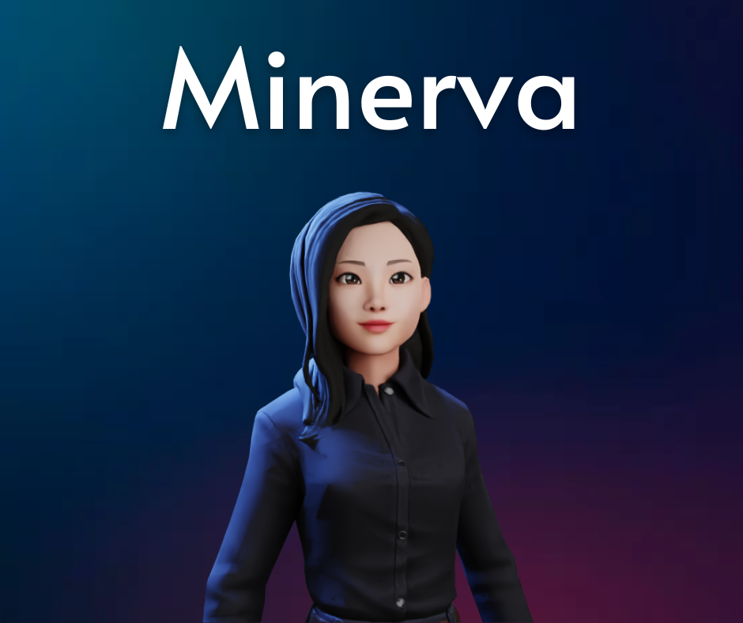

# Minerva

<strong>Olá, bem vindo(a) ao repositório da Minerva!</strong>

Minerva é uma assistente virtual Open Source feita em Python. Fique livre para adicionar comandos e usar como quiser.
O projeto está em andamento, sendo realizado na maior parte em sala de aula.

Minerva is an Open Souce Virtual Assistant made in Python.

Este projeto foi criado para o projeto final do Entra21, Python Verspertino, 2022

Criadores: Marina Farias, Joilson Julkoski, Henrique Samuel, Mariana Possamai.
