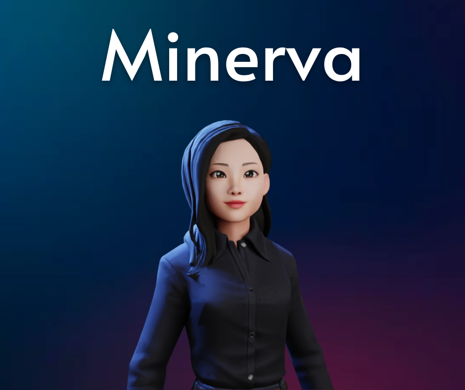

# Minerva

<h3>O que é?</h3>
Minerva é uma assistente virtual Open Source feita em Python. Escuta e responde de acordo com o que a foi programado. É usada a tecnologia de Speech Recognition e Sintetizador de voz Azure para resposta. 

<h3>Como faço pra começar?</h3>
<h4>Para instalar os requirements:</h4>
<code>$ pip install -r requirements.txt</code>

<h3>Como contatar os devs</h3>
<h4>Você pode contatar o devs para tirar dúvidas pelo Linkedin:</h4>
[Mariana Possamai] (https://www.linkedin.com/in/mariana-possamai-bb899a214)  
[Marina Farias] (https://www.linkedin.com/in/marinafariastech/)  
[Joilson Julkoski] (https://www.linkedin.com/in/joilson-julkoski-souza-2116581a8/)  
[Henrique Andrade] (https://www.linkedin.com/in/henrique-samuel-de-andrade-2165a8244/)  

 

O projeto está em andamento, assim como seu READ.me, sendo realizado na maior parte em sala de aula. 
Minerva is an Open Souce Virtual Assistant made in Python.

Este projeto foi criado para o projeto final do Entra21, Python Verspertino, 2022

Criadores: Marina Farias, Joilson Julkoski, Henrique Samuel, Mariana Possamai.
